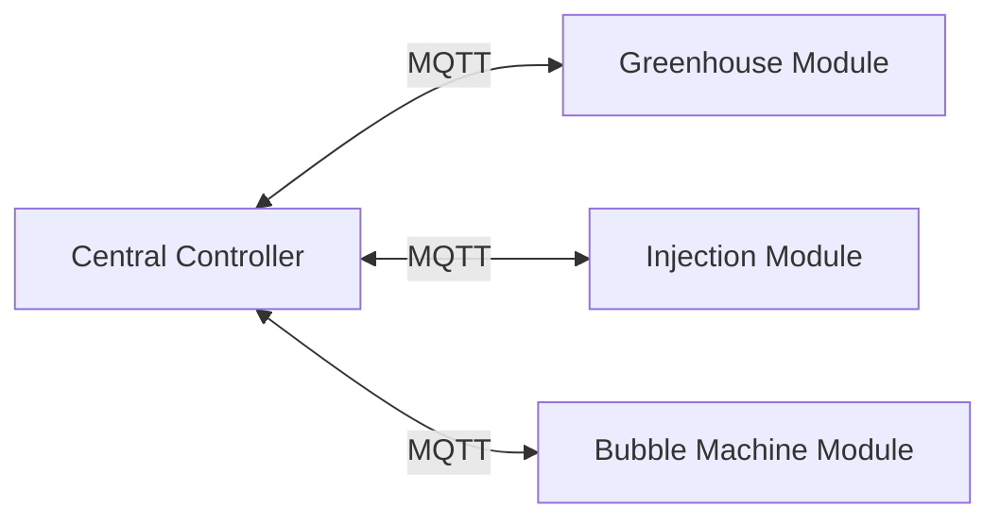

# Eco-Exoskeleton System for Ecological Restoration

## Overview
The Eco-Exoskeleton System is an advanced robotics platform designed for environmental restoration in challenging ecosystems. This system integrates three specialized modules deployed on ESP32 microcontrollers, coordinated by a central decision system that processes environmental data and executes repair strategies.

The system features:
- **Modular architecture** with independent greenhouse, injection, and bubble machine modules
- **Real-time decision making** based on environmental sensor data
- **MQTT-based communication** for reliable distributed control
- **Fault-tolerant design** with error recovery mechanisms
- **Emergency stop functionality** for safety-critical operations

## System Architecture
The system follows a distributed architecture with three ESP32 modules communicating with a central controller:



## Repository Structure
```
eco_exoskeleton_system/
├── main.py                 # System entry point
├── config.py               # Configuration parameters
├── models.py               # Data models and structures
├── cli.py                  # Command-line interface
├── decision_system.py      # Central decision logic
├── mqtt_manager.py         # MQTT communication handler
├── system_controller.py    # Main system controller
├── log_manager.py          # Logging management
├── test_sensor_generator.py# Test sensor data generator
└── esp32_firmware/         # ESP32 firmware modules
```

## File Descriptions

### 1. config.py
Contains all system configuration parameters:
- MQTT broker connection details
- Topic definitions for module communication
- System timing parameters (control loop frequency, decision interval)

### 2. models.py
Defines data structures and enums used throughout the system:
- `ModuleState`: Enumeration of possible module states
- `SensorData`: Structure for environmental sensor readings
- `ModuleStatus`: Representation of module operational status
- `Command`: Data structure for system commands

### 3. decision_system.py
Implements the central decision-making logic:
- Environmental data processing and analysis
- Repair plan generation
- Module coordination and task sequencing
- Error handling and recovery strategies
- Autonomous environmental monitoring

### 4. mqtt_manager.py
Handles all MQTT communication:
- Connection management to MQTT broker
- Message processing from ESP32 modules
- Command dispatching to modules
- Sensor data ingestion and parsing
- Status update handling

### 5. system_controller.py
Main system controller:
- System lifecycle management (startup/shutdown)
- Control thread implementation
- Emergency stop functionality
- Module coordination
- Decision system integration

### 6. cli.py
Command-line interface for system control:
- Interactive command processing
- System status display
- Manual command execution
- Emergency operations interface

### 7. main.py
System entry point:
- Initializes system components
- Launches command-line interface
- Handles system shutdown

## Installation and Usage

### Prerequisites
- Python 3.8+
- Paho-MQTT library: `pip install paho-mqtt`
- MQTT broker (e.g., Mosquitto)

### Running the System
1. Configure MQTT settings in `config.py`
2. Start the MQTT broker
3. Deploy ESP32 modules with corresponding firmware
4. Run the system: `python main.py`

### CLI Commands
```
> start       # Start the system
> stop        # Graceful system shutdown
> status      # Display system status
> emergency   # Emergency stop all modules
> exit        # Exit the application
```

### Test Mode
If you do not have real sensor data, you can use the test sensor generator to simulate environmental data:
```
python test_sensor_generator.py
```
This will automatically generate random sensor data and push it to the decision system, allowing you to fully test the system logic.

## Communication Protocol

### Command Format (to modules)
```json
{
  "action": "deploy",
  "params": {
    "location": [52.3, 12.8],
    "max_wind": 8.0
  }
}
```

### Sensor Data Format (from modules)
```json
{
  "temperature": 25.3,
  "humidity": 45.2,
  "deployed": true,
  "retracted": false
}
```

### Status Update Format (from modules)
```json
{
  "module": "greenhouse",
  "state": "DEPLOYING",
  "message": "Expansion in progress...",
  "timestamp": 1678901234.567
}
```

## Academic References
This implementation incorporates concepts from:
1. Distributed Control Systems (DCS)
2. Publish-Subscribe Architecture Patterns
3. Fault-Tolerant System Design
4. Real-Time Decision Making in Robotics
5. Environmental Sensing and Response Systems
