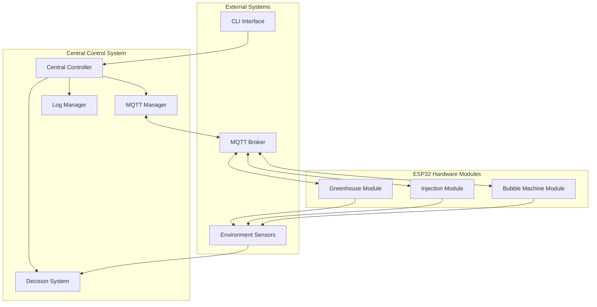
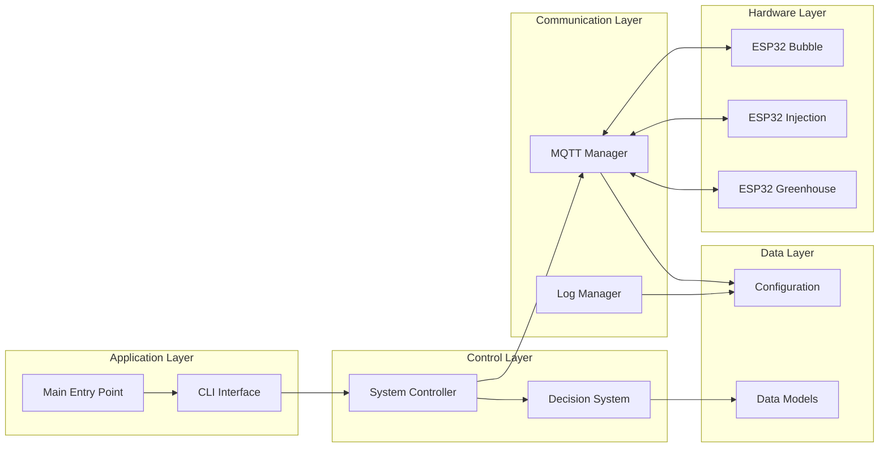
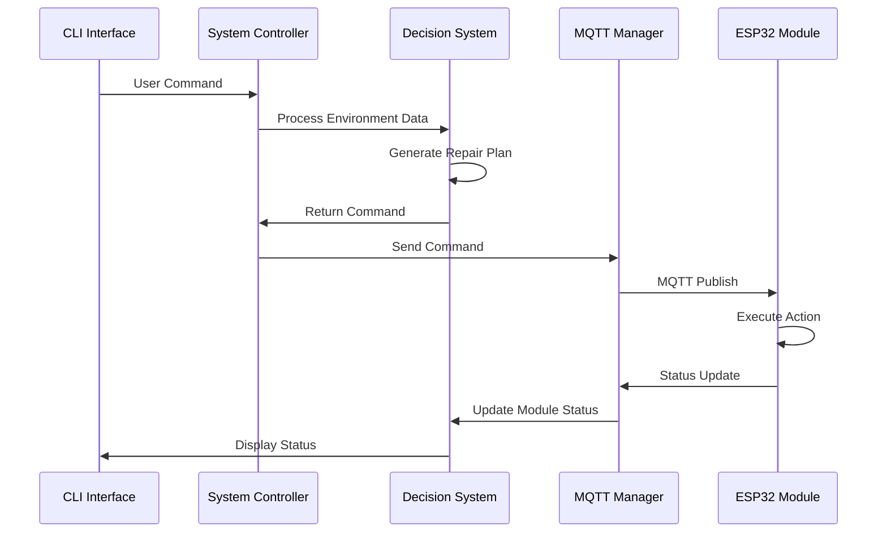
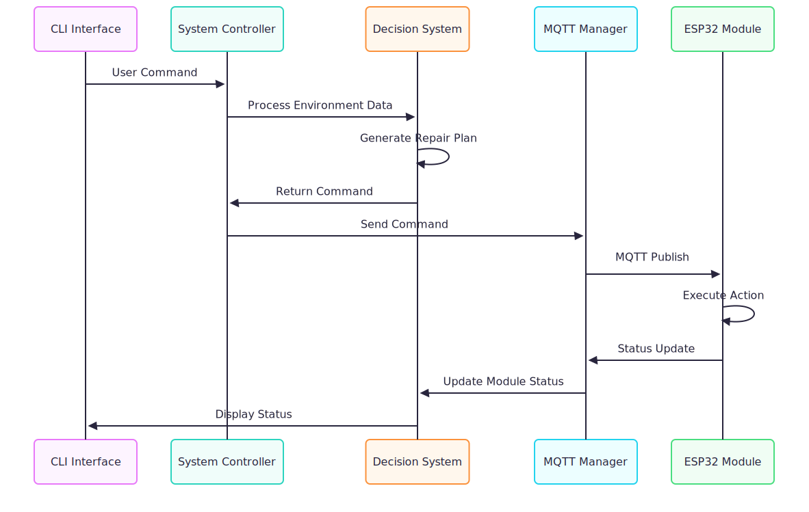
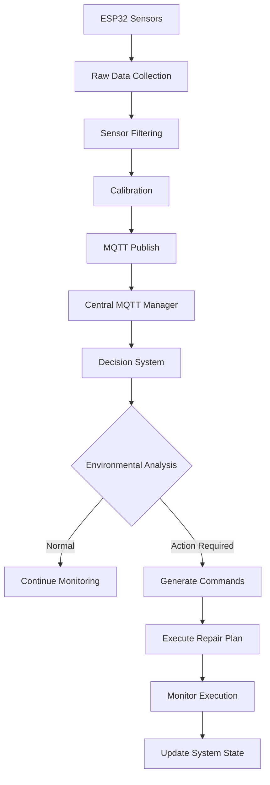

# Eco-Exoskeleton System for Ecological Restoration

[](https://python.org)
[](https://espressif.com)
[](https://mqtt.org)

## Overview

The Eco-Exoskeleton System is an advanced distributed robotics platform designed for autonomous ecological restoration in challenging environments. The system integrates multiple specialized ESP32-based modules that work collaboratively to deploy protective structures, inject nutrients, and apply repair solutions for environmental restoration projects.

### Key Features

- **Distributed Architecture**: Independent ESP32 modules with centralized coordination
- **Real-time Decision Making**: AI-driven environmental assessment and response
- **Fault-tolerant Design**: Robust error handling and recovery mechanisms
- **MQTT Communication**: Reliable publish-subscribe messaging protocol
- **Comprehensive Logging**: Multi-level debugging and monitoring system
- **Modular Hardware**: Expandable sensor and actuator configurations

## System Architecture

### High-Level System Overview





### Module Hierarchy and Dependencies





## System Components

### 1. Central Control System (`eco_exoskeleton_system_py/`)

#### Core Modules

| Module | File | Purpose |
|--------|------|---------|
| **System Controller** | `core/system_controller.py` | Main system orchestration and lifecycle management |
| **Decision System** | `core/decision_system.py` | AI-driven environmental analysis and repair planning |
| **MQTT Manager** | `core/mqtt_manager.py` | Communication hub for all ESP32 modules |
| **Log Manager** | `core/log_manager.py` | Centralized logging and monitoring system |

#### Supporting Components

| Module | File | Purpose |
|--------|------|---------|
| **Data Models** | `models.py` | Type-safe data structures and enumerations |
| **Configuration** | `config.py` | System parameters and MQTT topics |
| **CLI Interface** | `cli.py` | Interactive command-line control |
| **Test Generator** | `test_sensor_generator.py` | Simulated sensor data for testing |

### 2. ESP32 Hardware Modules (`esp32_firmware/`)

#### Greenhouse Module
- **Purpose**: Deploys and retracts foldable greenhouse structures
- **Sensors**: Temperature, humidity, position feedback
- **Actuators**: Dual-state deployment mechanism
- **Communication**: Real-time status and environmental data

#### Injection Module  
- **Purpose**: Precise soil nutrient injection with depth control
- **Sensors**: Depth, pressure, needle position
- **Actuators**: PWM-controlled injection motor
- **Communication**: Injection parameters and progress monitoring

#### Bubble Machine Module
- **Purpose**: Controlled spraying of repair solutions
- **Sensors**: Flow rate, tank level, system pressure
- **Actuators**: Variable intensity spray nozzle
- **Communication**: Spray commands and flow monitoring

#### Shared Components
- **MQTT Helper** (`mqtt_helper.cpp/h`): WiFi and MQTT communication library
- **Debug Helper** (`debug_helper.cpp/h`): Multi-level logging and diagnostics
- **Sensor Filters** (`sensor_filter.h`): Moving average noise reduction
- **Calibration** (`sensor_calibration.h`): Sensor value correction algorithms

## System Communication Flow

### Command Execution Flow





### Sensor Data Processing Flow





## Installation and Setup

### Prerequisites

- **Python**: 3.11 or higher
- **ESP-IDF**: v4.4+ for ESP32 development
- **MQTT Broker**: Mosquitto or equivalent
- **Hardware**: ESP32 development boards with sensors/actuators

### Python Environment Setup

```bash
# Clone the repository
git clone <repository-url>
cd eco-exoskeleton-system

# Install dependencies using uv (recommended)
uv sync

# Or using pip
pip install -r requirements.txt
```

### ESP32 Firmware Setup

```bash
# Set up ESP-IDF environment
source $IDF_PATH/export.sh

# Build all firmware modules
cd esp32_firmware
./build.sh

# Flash individual modules
idf.py -B build/greenhouse_module -p /dev/ttyUSB0 flash
idf.py -B build/injection_module -p /dev/ttyUSB1 flash
idf.py -B build/bubble_machine_module -p /dev/ttyUSB2 flash
```

### Configuration

1. **Update WiFi Credentials** in ESP32 module files:
   ```cpp
   const char* WIFI_SSID = "Your_Network";
   const char* WIFI_PASS = "Your_Password";
   ```

2. **Configure MQTT Broker** in `config.py`:
   ```python
   MQTT_BROKER = "your-mqtt-broker-ip"
   MQTT_PORT = 1883
   ```

3. **Set Environment Variables** for security:
   ```bash
   export MQTT_USER="your_username"
   export MQTT_PASS="your_password"
   ```

## Usage

### Starting the System

```bash
# Start with real hardware
python eco_exoskeleton_system_py/main.py

# Start with simulated sensors
python eco_exoskeleton_system_py/main.py --test
```

### CLI Commands

| Command | Description |
|---------|-------------|
| `start` | Initialize and start the system |
| `stop` | Graceful system shutdown |
| `status` | Display current system status |
| `emergency` | Emergency stop all modules |
| `exit` | Exit the application |

### Testing with Simulated Data

```bash
# Run sensor data simulator
python eco_exoskeleton_system_py/test_sensor_generator.py
```

## MQTT Communication Protocol

### Topic Structure

| Module | Command | Status | Sensors |
|--------|---------|--------|---------|
| Greenhouse | `exoskeleton/greenhouse/command` | `exoskeleton/greenhouse/status` | `exoskeleton/greenhouse/sensors` |
| Injection | `exoskeleton/injection/command` | `exoskeleton/injection/status` | `exoskeleton/injection/sensors` |
| Bubble | `exoskeleton/bubble/command` | `exoskeleton/bubble/status` | `exoskeleton/bubble/sensors` |

### Message Formats

#### Command Message
```json
{
  "action": "deploy",
  "params": {
    "location": [52.3, 12.8],
    "max_wind": 8.0
  }
}
```

#### Status Message
```json
{
  "module": "greenhouse",
  "state": "DEPLOYING",
  "message": "Expansion in progress...",
  "timestamp": 1678901234567
}
```

#### Sensor Data
```json
{
  "temperature": 25.3,
  "humidity": 45.2,
  "deployed": true,
  "retracted": false
}
```

## Logging and Monitoring

### Log Levels
- **ERROR**: Critical failures requiring attention
- **WARNING**: Non-critical issues and retries
- **INFO**: General system operations
- **VERBOSE**: Detailed debugging information

### Log Files
- **System Logs**: `logs/system.log`
- **Test Logs**: `logs/test_sensor.log`

### Real-time Monitoring
```bash
# Monitor system logs
tail -f logs/system.log

# Monitor ESP32 output
idf.py -p /dev/ttyUSB0 monitor
```

## Development and Debugging

### Adding New Modules

1. **Create ESP32 Module**:
   - Implement sensor reading functions
   - Add MQTT communication handlers
   - Include status reporting mechanisms

2. **Update Central System**:
   - Add new topics to `config.py`
   - Extend `mqtt_manager.py` message handlers
   - Update `decision_system.py` logic

3. **Test Integration**:
   - Use test sensor generator
   - Verify MQTT communication
   - Validate decision system responses

### Debugging Tips

1. **Enable Verbose Logging**:
   ```python
   setup_logging(level=logging.DEBUG)
   ```

2. **ESP32 Debug Output**:
   ```cpp
   DebugHelper::setLevel(DEBUG_LEVEL_VERBOSE);
   ```

3. **MQTT Message Inspection**:
   ```bash
   mosquitto_sub -h localhost -t "exoskeleton/+/+"
   ```

## Contributing

1. **Code Style**: Follow PEP 8 for Python, ESP-IDF conventions for C++
2. **Testing**: Add tests for new functionality
3. **Documentation**: Update README and inline comments
4. **Logging**: Use appropriate log levels for new features

## Acknowledgments

- ESP-IDF framework by Espressif Systems
- Paho MQTT client library
- ArduinoJSON for ESP32 JSON parsing
- Contributors and testers

---

**Note**: This system is designed for research and development purposes. Ensure proper safety measures when deploying in real-world environments.
