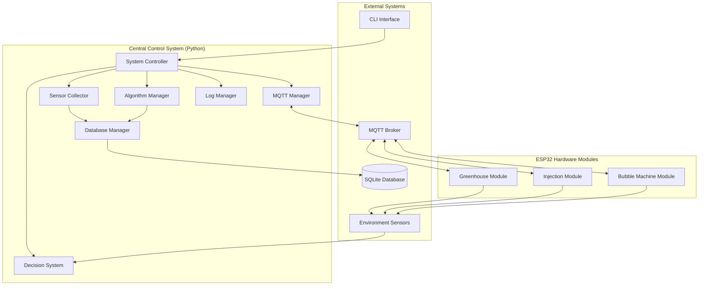
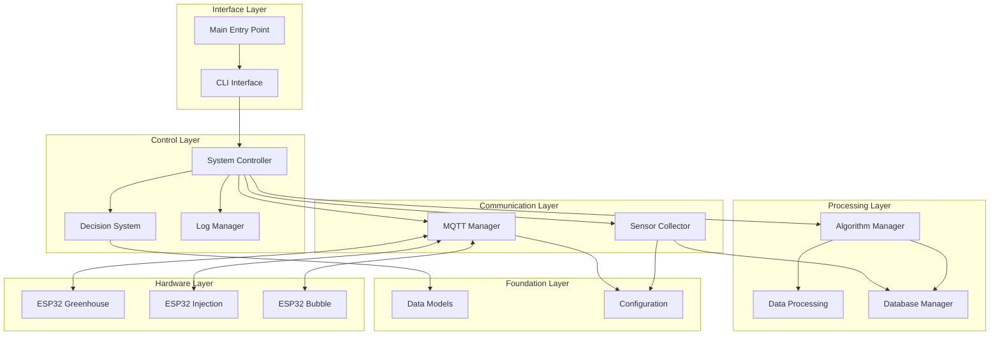

# Eco-Exoskeleton System for Ecological Restoration

[](https://python.org)
[](https://espressif.com)
[](https://mqtt.org)
[](https://sqlite.org)
[](https://docs.astral.sh/uv/)

## 🌱 Overview

The **Eco-Exoskeleton System** is an advanced distributed robotics platform designed for autonomous ecological restoration in challenging environments. This system integrates multiple specialized ESP32-based modules that work collaboratively to deploy protective structures, inject nutrients, and apply repair solutions for environmental restoration projects.

### 🚀 Key Features

- **🏗️ Modular Architecture**: Independent ESP32 modules with centralized coordination
- **🧠 Real-time Decision Making**: AI-driven environmental assessment and response
- **🔄 Fault-tolerant Design**: Robust error handling and recovery mechanisms
- **📡 MQTT Communication**: Reliable publish-subscribe messaging protocol
- **📊 Data Processing**: Advanced algorithms for sensor data analysis
- **💾 Database Integration**: SQLite-based data persistence and analytics
- **📝 Comprehensive Logging**: Multi-level debugging and monitoring system
- **🔧 Expandable Hardware**: Modular sensor and actuator configurations

## 🏗️ System Architecture

### High-Level System Overview



### Module Hierarchy and Dependencies



## 📁 Project Structure

```
eco-exoskeleton-system/
├── 📄 README_ALL.md              # This comprehensive documentation
├── 📄 pyproject.toml             # Project configuration and dependencies
├── 📄 uv.lock                    # Dependency lock file
├── 📄 main.py                    # System entry point
├── 📁 src/
│   └── 📁 eco_exoskeleton/       # Main package directory
│       ├── 📄 __init__.py        # Package initialization
│       ├── 📄 config.py          # System configuration
│       ├── 📄 models.py          # Data models and structures
│       ├── 📄 log_manager.py     # Logging management
│       ├── 📄 decision_system.py # Central decision logic
│       ├── 📄 mqtt_manager.py    # MQTT communication handler
│       ├── 📄 sensor_collector.py# Sensor data collection
│       ├── 📄 data_processing.py # Data processing algorithms
│       ├── 📄 algorithm_manager.py# Algorithm management
│       ├── 📄 database_manager.py# Database operations
│       ├── 📄 system_controller.py# Main system controller
│       ├── 📄 cli.py             # Command-line interface
│       ├── 📄 algorithm_demo.py  # Algorithm demonstration
│       ├── 📄 database_demo.py   # Database demonstration
│       └── 📄 test_sensor_generator.py # Test data generator
├── 📁 esp32_firmware/            # ESP32 hardware modules
│   ├── 📄 README.md              # ESP32 documentation
│   ├── 📄 greenhouse_module.c    # Greenhouse control firmware
│   ├── 📄 injection_module.c     # Injection control firmware
│   ├── 📄 bubble_machine_module.c# Bubble machine firmware
│   ├── 📄 mqtt_helper.cpp        # MQTT communication library
│   ├── 📄 debug_helper.cpp       # Debugging utilities
│   ├── 📄 sensor_filter.h        # Sensor filtering algorithms
│   └── 📄 sensor_calibration.h   # Sensor calibration functions
├── 📁 img/                       # System architecture diagrams
└── 📁 logs/                      # System logs (auto-generated)
```

## 🔧 System Components

### 1. Central Control System (Python Package)

#### Foundation Layer
| Module | File | Purpose |
|--------|------|---------|
| **Data Models** | `models.py` | Type-safe data structures and enumerations |
| **Configuration** | `config.py` | System parameters and MQTT topics |

#### Communication Layer
| Module | File | Purpose |
|--------|------|---------|
| **MQTT Manager** | `mqtt_manager.py` | Communication hub for all ESP32 modules |
| **Sensor Collector** | `sensor_collector.py` | Real-time sensor data collection and caching |

#### Processing Layer
| Module | File | Purpose |
|--------|------|---------|
| **Data Processing** | `data_processing.py` | Advanced algorithms (Kalman filter, outlier detection, etc.) |
| **Algorithm Manager** | `algorithm_manager.py` | Algorithm registration and pipeline management |
| **Database Manager** | `database_manager.py` | SQLite database operations and analytics |

#### Control Layer
| Module | File | Purpose |
|--------|------|---------|
| **System Controller** | `system_controller.py` | Main system orchestration and lifecycle management |
| **Decision System** | `decision_system.py` | AI-driven environmental analysis and repair planning |
| **Log Manager** | `log_manager.py` | Centralized logging and monitoring system |

#### Interface Layer
| Module | File | Purpose |
|--------|------|---------|
| **CLI Interface** | `cli.py` | Interactive command-line control |
| **Main Entry** | `main.py` | System entry point and initialization |

#### Demo Layer
| Module | File | Purpose |
|--------|------|---------|
| **Algorithm Demo** | `algorithm_demo.py` | Algorithm functionality demonstration |
| **Database Demo** | `database_demo.py` | Database operations demonstration |
| **Test Generator** | `test_sensor_generator.py` | Simulated sensor data for testing |

### 2. ESP32 Hardware Modules

#### Greenhouse Module
- **Purpose**: Deploys and retracts foldable greenhouse structures
- **Sensors**: Temperature, humidity, position feedback
- **Actuators**: Dual-state deployment mechanism
- **Communication**: Real-time status and environmental data

#### Injection Module  
- **Purpose**: Precise soil nutrient injection with depth control
- **Sensors**: Depth, pressure, needle position
- **Actuators**: PWM-controlled injection motor
- **Communication**: Injection parameters and progress monitoring

#### Bubble Machine Module
- **Purpose**: Controlled spraying of repair solutions
- **Sensors**: Flow rate, tank level, system pressure
- **Actuators**: Variable intensity spray nozzle
- **Communication**: Spray commands and flow monitoring

## 🚀 Installation and Setup

### Prerequisites

- **Python 3.11+**
- **UV Package Manager** (recommended) or pip
- **MQTT Broker** (e.g., Mosquitto, HiveMQ)
- **ESP32 Development Environment** (for hardware modules)

### Quick Start

1. **Clone the repository**:
   ```bash
   git clone <repository-url>
   cd eco-exoskeleton-system
   ```

2. **Install dependencies**:
   ```bash
   # Using UV (recommended)
   uv sync
   
   # Or using pip
   pip install -r requirements.txt
   ```

3. **Configure the system**:
   ```bash
   # Edit MQTT settings
   nano src/eco_exoskeleton/config.py
   ```

4. **Run the system**:
   ```bash
   # Using UV
   PYTHONPATH=src uv run python main.py
   
   # Or directly
   PYTHONPATH=src python main.py
   ```

### Development Setup

```bash
# Install development dependencies
uv sync --extra dev

# Install demo dependencies
uv sync --extra demo

# Install all dependencies
uv sync --all-extras
```

## 🎮 Usage

### CLI Commands

Once the system is running, you can use the following commands:

| Command | Description |
|---------|-------------|
| `start` | Start the system |
| `stop` | Graceful system shutdown |
| `status` | Display current system status |
| `emergency` | Emergency stop all modules |
| `algorithms` | Show available algorithms |
| `sensor_data` | Display sensor data |
| `processed_data` | Show algorithm processing results |
| `pipelines` | Display processing pipeline status |
| `database` | Show database information |
| `db_stats` | Display database statistics |
| `db_cleanup` | Clean old database records |
| `help` | Show command help |
| `exit` | Exit the application |

### Demo Scripts

```bash
# Run algorithm demonstration
PYTHONPATH=src uv run python src/eco_exoskeleton/algorithm_demo.py

# Run database demonstration
PYTHONPATH=src uv run python src/eco_exoskeleton/database_demo.py

# Run test sensor generator
PYTHONPATH=src uv run python src/eco_exoskeleton/test_sensor_generator.py
```

## 📡 Communication Protocol

### MQTT Topics

| Module | Command Topic | Status Topic | Sensor Topic |
|--------|---------------|--------------|--------------|
| Greenhouse | `exoskeleton/greenhouse/command` | `exoskeleton/greenhouse/status` | `exoskeleton/greenhouse/sensors` |
| Injection | `exoskeleton/injection/command` | `exoskeleton/injection/status` | `exoskeleton/injection/sensors` |
| Bubble | `exoskeleton/bubble/command` | `exoskeleton/bubble/status` | `exoskeleton/bubble/sensors` |

### Message Formats

#### Command Message
```json
{
  "action": "deploy",
  "params": {
    "location": [52.3, 12.8],
    "max_wind": 8.0
  }
}
```

#### Status Message
```json
{
  "module": "greenhouse",
  "state": "DEPLOYING",
  "message": "Expansion in progress...",
  "timestamp": 1678901234567
}
```

#### Sensor Data
```json
{
  "temperature": 25.3,
  "humidity": 45.2,
  "deployed": true,
  "retracted": false
}
```

## 🧠 Data Processing Algorithms

The system includes several advanced data processing algorithms:

### Available Algorithms

1. **Moving Average Filter**: Noise reduction for sensor data
2. **Kalman Filter**: Advanced state estimation and prediction
3. **Outlier Detector**: Anomaly detection using Z-score method
4. **Trend Analyzer**: Linear regression trend analysis
5. **Statistical Analyzer**: Descriptive statistics computation
6. **Data Fusion Processor**: Multi-sensor data fusion
7. **Adaptive Filter**: Dynamic parameter adjustment

### Processing Pipeline


## 💾 Database Management

### Features

- **SQLite Database**: Lightweight, file-based storage
- **Real-time Storage**: Automatic sensor data persistence
- **Algorithm Results**: Processing results and metadata storage
- **System Status**: Historical status tracking
- **Data Analytics**: Statistical analysis and reporting
- **Automatic Cleanup**: Configurable data retention policies

### Database Commands

```bash
# View database information
database

# Show statistics (last 24 hours)
db_stats

# Clean old data (interactive)
db_cleanup
```

## 🔧 ESP32 Firmware

### Building and Flashing

```bash
cd esp32_firmware

# Build all modules
./build.sh

# Flash specific module
idf.py -p /dev/ttyUSB0 flash monitor
```

### Hardware Requirements

#### Greenhouse Module
- 2x Digital output pins (deploy/retract control)
- 2x Digital input pins (position feedback)
- 2x Analog input pins (temperature/humidity sensors)
- WiFi connectivity

#### Injection Module
- 1x PWM output pin (motor control)
- 2x Analog input pins (depth/pressure sensors)
- 1x Digital input pin (needle position)
- WiFi connectivity

#### Bubble Machine Module
- 1x PWM output pin (nozzle control)
- 3x Analog input pins (flow/level/pressure)
- WiFi connectivity

## 🧪 Testing

### Test Mode

Run the system in test mode with simulated sensor data:

```bash
PYTHONPATH=src uv run python main.py --test
```

### Unit Tests

```bash
# Run all tests
uv run pytest

# Run specific test module
uv run pytest tests/test_algorithm_manager.py
```

### Integration Tests

```bash
# Test MQTT communication
uv run python tests/test_mqtt_integration.py

# Test database operations
uv run python tests/test_database_operations.py
```

## 📊 Monitoring and Logging

### Log Levels

- **ERROR**: Critical failures requiring attention
- **WARNING**: Non-critical issues and retries
- **INFO**: General system operations
- **DEBUG**: Detailed debugging information

### Log Files

- **System Logs**: `logs/system.log`
- **Test Logs**: `logs/test_sensor.log`
- **Database Logs**: `logs/database.log`

### Real-time Monitoring

```bash
# Monitor system logs
tail -f logs/system.log

# Monitor ESP32 output
idf.py -p /dev/ttyUSB0 monitor
```

## 🔧 Configuration

### System Configuration (`config.py`)

```python
# MQTT Configuration
MQTT_BROKER = "192.168.1.100"
MQTT_PORT = 1883
MQTT_USER = "admin"
MQTT_PASS = "password"

# System Parameters
CONTROL_LOOP_FREQ = 10  # Hz
DECISION_INTERVAL = 1.0  # seconds
```

### Database Configuration

```python
# Database settings (in database_manager.py)
DEFAULT_DB_PATH = "sensor_data.db"
DEFAULT_BUFFER_SIZE = 1000
DEFAULT_RETENTION_DAYS = 30
```

## 🚨 Troubleshooting

### Common Issues

#### MQTT Connection Problems
```bash
# Check MQTT broker status
systemctl status mosquitto

# Test MQTT connectivity
mosquitto_pub -h 192.168.1.100 -t test/topic -m "test"
```

#### Database Issues
```bash
# Check database file
ls -la sensor_data.db

# Verify database integrity
sqlite3 sensor_data.db "PRAGMA integrity_check;"
```

#### ESP32 Flashing Issues
```bash
# Reset ESP32 to bootloader
esptool.py --port /dev/ttyUSB0 erase_flash

# Flash firmware
idf.py -p /dev/ttyUSB0 flash
```

### Debug Mode

Enable debug logging:

```python
# In config.py
DEBUG_LEVEL = logging.DEBUG
```

## 📚 API Reference

### Core Classes

#### EcologicalExoskeletonSystem
Main system controller class.

```python
from eco_exoskeleton.system_controller import EcologicalExoskeletonSystem

system = EcologicalExoskeletonSystem(test_mode=False)
system.start()
system.stop()
```

#### SensorCollector
Real-time sensor data collection.

```python
from eco_exoskeleton.sensor_collector import get_sensor_collector

collector = get_sensor_collector()
collector.connect()
data = collector.get_latest_data("greenhouse")
```

#### AlgorithmManager
Data processing algorithm management.

```python
from eco_exoskeleton.algorithm_manager import get_algorithm_manager

manager = get_algorithm_manager()
result = manager.process_data("moving_average", 25.5)
```

#### DatabaseManager
Database operations and analytics.

```python
from eco_exoskeleton.database_manager import get_database_manager

db = get_database_manager()
stats = db.get_statistics(hours_back=24)
```

## 🤝 Contributing

### Development Workflow

1. **Fork the repository**
2. **Create a feature branch**
3. **Make your changes**
4. **Add tests**
5. **Update documentation**
6. **Submit a pull request**

### Code Style

```bash
# Format code
uv run black src/eco_exoskeleton/

# Lint code
uv run flake8 src/eco_exoskeleton/

# Type checking
uv run mypy src/eco_exoskeleton/
```

## 📄 License

This project is licensed under the MIT License - see the [LICENSE](LICENSE) file for details.

## 🙏 Acknowledgments

- **ESP32 Framework**: Espressif Systems
- **MQTT Library**: Eclipse Paho
- **Data Processing**: NumPy, Pandas
- **Database**: SQLite
- **Package Management**: UV

## 📞 Support

For support and questions:

- **Issues**: [GitHub Issues](https://github.com/your-repo/issues)
- **Documentation**: [Wiki](https://github.com/your-repo/wiki)
- **Email**: support@your-organization.com

---

**Built with ❤️ for ecological restoration and environmental protection.** 