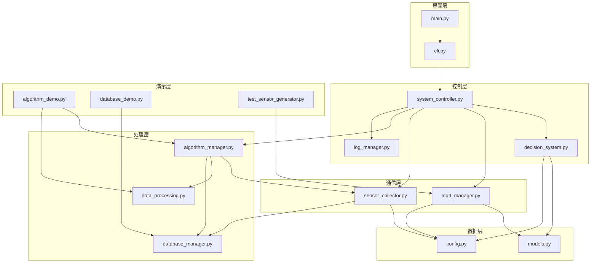

# 生态外骨骼系统 - 模块依赖关系

## 📋 项目模块架构

### 🔧 核心模块依赖关系



## 📦 模块详细说明

### 1. 基础层 (Foundation Layer)

| 模块 | 文件 | 依赖 | 功能 |
|------|------|------|------|
| **数据模型** | `models.py` | 无 | 定义系统数据结构和枚举 |
| **配置管理** | `config.py` | 无 | 系统配置参数和MQTT主题 |

### 2. 通信层 (Communication Layer)

| 模块 | 文件 | 依赖 | 功能 |
|------|------|------|------|
| **MQTT管理器** | `mqtt_manager.py` | models, config | MQTT通信和消息处理 |
| **传感器收集器** | `sensor_collector.py` | config, database_manager | 传感器数据收集和缓存 |

### 3. 处理层 (Processing Layer)

| 模块 | 文件 | 依赖 | 功能 |
|------|------|------|------|
| **数据处理** | `data_processing.py` | 无 | 各种数据处理算法实现 |
| **算法管理器** | `algorithm_manager.py` | sensor_collector, data_processing, database_manager | 算法注册和管道管理 |
| **数据库管理器** | `database_manager.py` | 无 | SQLite数据库操作 |

### 4. 控制层 (Control Layer)

| 模块 | 文件 | 依赖 | 功能 |
|------|------|------|------|
| **决策系统** | `decision_system.py` | models, config | 智能决策和修复规划 |
| **系统控制器** | `system_controller.py` | decision_system, mqtt_manager, sensor_collector, algorithm_manager | 系统整体协调 |
| **日志管理器** | `log_manager.py` | 无 | 日志记录和管理 |

### 5. 界面层 (Interface Layer)

| 模块 | 文件 | 依赖 | 功能 |
|------|------|------|------|
| **命令行界面** | `cli.py` | system_controller | 用户交互界面 |
| **主程序入口** | `main.py` | cli | 程序启动入口 |

### 6. 演示层 (Demo Layer)

| 模块 | 文件 | 依赖 | 功能 |
|------|------|------|------|
| **算法演示** | `algorithm_demo.py` | algorithm_manager, data_processing | 算法功能演示 |
| **数据库演示** | `database_demo.py` | database_manager | 数据库功能演示 |
| **测试生成器** | `test_sensor_generator.py` | mqtt_manager | 模拟传感器数据 |

## 🔄 依赖管理策略

### 当前策略：扁平化模块管理

```
优点：
✅ 简单直接，适合单项目开发
✅ 模块间直接导入，无额外复杂性
✅ 便于快速开发和调试
✅ uv管理外部依赖，内部模块自管理

适用场景：
🎯 单项目开发
🎯 团队规模较小
🎯 模块数量适中（<20个）
🎯 快速原型开发
```

### 可选策略：包化模块管理

```
优点：
✅ 更好的模块隔离
✅ 便于单元测试
✅ 支持多项目复用
✅ 更规范的包结构

适用场景：
🎯 大型项目
🎯 多项目共享模块
🎯 需要发布到PyPI
🎯 严格的代码组织要求
```

## 🛠️ 依赖管理命令

### 使用uv管理依赖

```bash
# 安装基础依赖
uv sync

# 安装开发依赖
uv sync --extra dev

# 安装演示依赖
uv sync --extra demo

# 安装所有依赖
uv sync --all-extras

# 更新依赖
uv lock --upgrade

# 运行系统
uv run python main.py

# 运行演示
uv run python algorithm_demo.py
uv run python database_demo.py
```

### 模块导入规范

```python
# ✅ 推荐：相对导入（如果使用包结构）
from .models import SensorData
from .config import MQTT_BROKER

# ✅ 当前：直接导入（扁平结构）
from models import SensorData
from config import MQTT_BROKER

# ❌ 避免：绝对导入（除非发布包）
from eco_exoskeleton.models import SensorData
```

## 📊 模块复杂度分析

| 模块类型 | 数量 | 平均行数 | 复杂度 |
|----------|------|----------|--------|
| 基础层 | 2 | 30行 | 低 |
| 通信层 | 2 | 200行 | 中 |
| 处理层 | 3 | 300行 | 高 |
| 控制层 | 3 | 100行 | 中 |
| 界面层 | 2 | 20行 | 低 |
| 演示层 | 3 | 150行 | 中 |

**总体评估**：当前架构适合您的项目规模和复杂度。

## 💡 建议

1. **保持当前架构**：对于您的项目，扁平化模块管理是最佳选择
2. **使用uv管理**：继续使用uv管理外部依赖
3. **模块化开发**：保持模块间的清晰边界和职责分离
4. **文档维护**：及时更新模块依赖关系文档
5. **测试覆盖**：为关键模块添加单元测试

您的模块管理策略已经很合理，无需过度工程化！ 